# 二手物品交易系统 ver 1.0

## 1 功能介绍

当前版本支持创建、修改、删除和查找物品

* 创建：输入物品名称，物品描述和联系人信息来创建物品，系统会自动分配唯一的物品ID
* 删除：选中物品，删除物品的所有信息；该物品ID不会被再次使用
* 修改：选中物品，在需要修改的属性中更改；不允许修改物品ID
* 查找：在查找栏中选择需要查找的属性，输入值进行查找，返回找到的所有物品；支持模糊查找

所有数据记录在一张名为`database.xlsx`的表格中，程序会自动读取并连接

---

## 2 使用方法

### 2.0 进入程序

下载整个文件夹，确保`database.xlsx, GUI.py, items.py`位于同一文件夹下方；选择合适的解释器（见`requirment.txt`）允许`GUI.py`进入GUI；可以按照示例直接在`database.xlsx`中输入数据，程序能够接收

---

### 2.1 界面一览

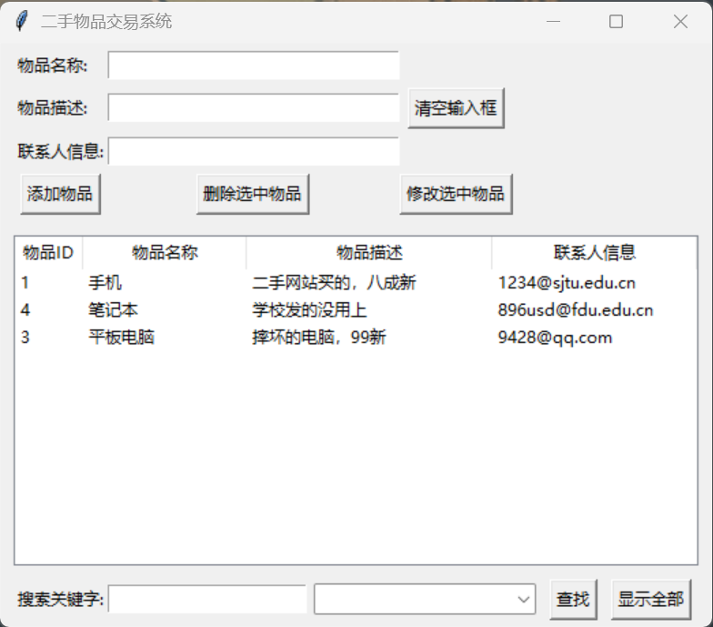

软件用户端如上

* 上部：输入物品的信息和对物品的操作
* 中部：当前检索到的物品列表，包括物品的全部可视信息
* 下部：搜索栏和对应选项

---

### 2.2 创建物品

在输入框中输入所有的信息，程序会创建一个新的物品并**立即**写入数据库；程序会自动赋予物品**唯一**的ID

如下图所示，在描述栏中输入信息，并单击`添加物品`，程序为这条信息分配了唯一的ID，并显示在列表中

<table>
    <tr>
    	<td>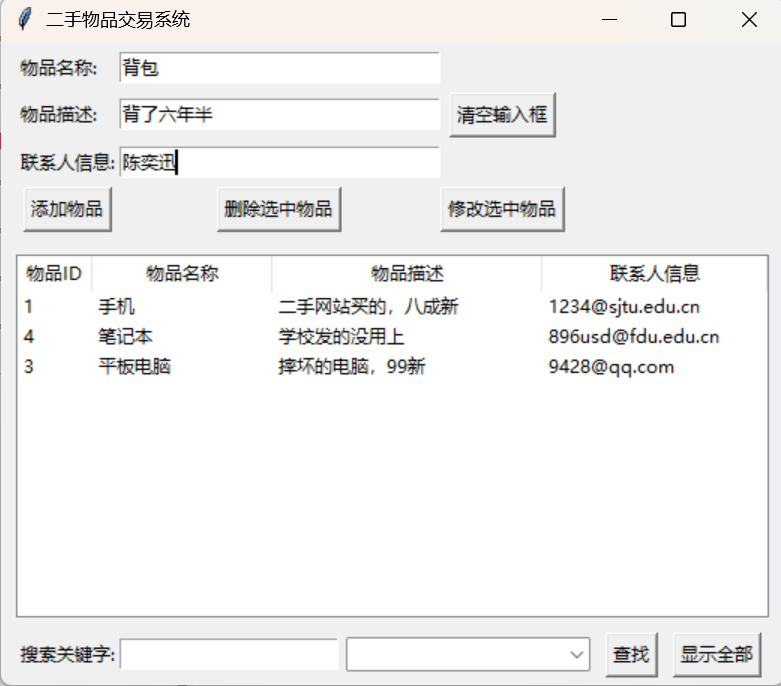</td>
        <td></td>
    </tr>
</table>

\*唯一的ID：出于性能考虑，ID仅自增，不会因为删除物品而减少；即ID记录了曾经创建过的所有物品；如上图，物品ID不存在2和5

如果创建过程中没有输入全部的信息，程序会给出警告

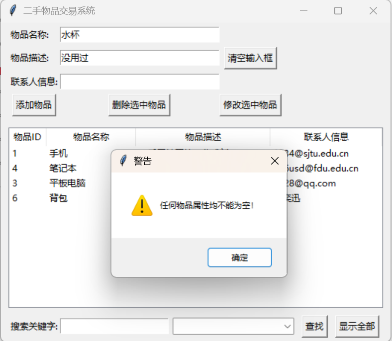

允许创建所有信息都相同的物品，因为物品ID`item.item_id`不可能相同；但不允许短时间内连续创建所有信息都相同的物品（后文）

---

### 2.3 删除物品

选择一条或多条当前列表中的记录，单击`删除选中物品`，这些物品在列表中删除。出于性能考虑，这些更改**不会立刻同步**到数据库；在GUI窗口后会进行数据同步

具体的实现机制如下：`物品`类拥有一个隐藏属性`item.valid: int`，默认值为`1`，表示该物品有效；当该物品被删除时，`item.valid=0`，作为逻辑删除；当关闭GUI窗口时，程序将所有数据写回时，`valid`属性为`0`的物品**不再写回**；数据库中不存储`item.valid`，仅在程序进程中保存

如果没有选中任何物品就单机按钮，会出现提示

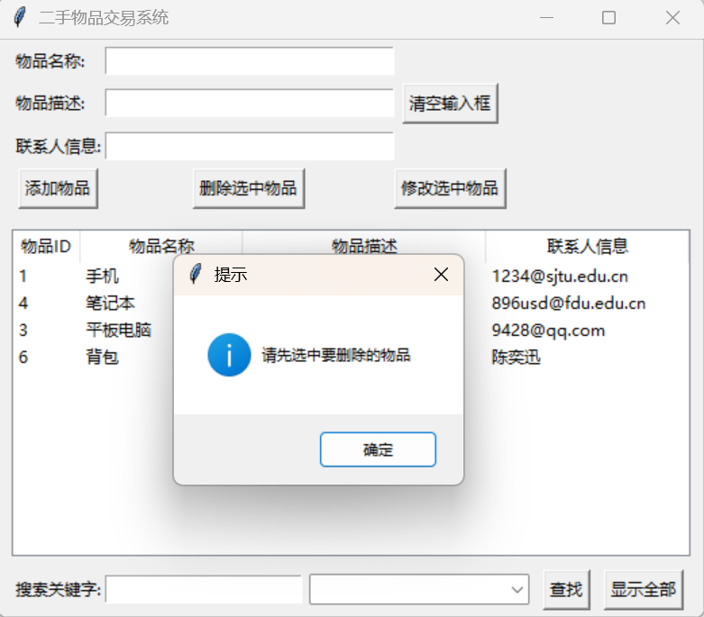

---

### 2.4 修改物品信息

选择一条记录，这条记录的描述会自动出现在上部对应方框内，修改方框内文本可以更改对应属性；出现“修改成功”的提示，点击确定，列表更新；**不允许修改物品ID**

如下图所示，修改物品ID=3的物品的描述后，该物品的描述更新，并列为表头

<table>
    <tr>
    	<td>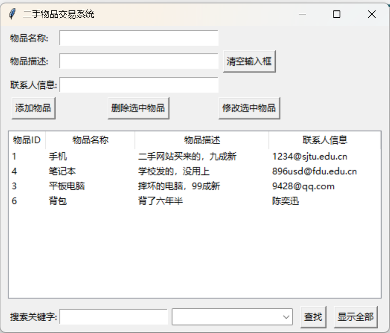</td>
        <td>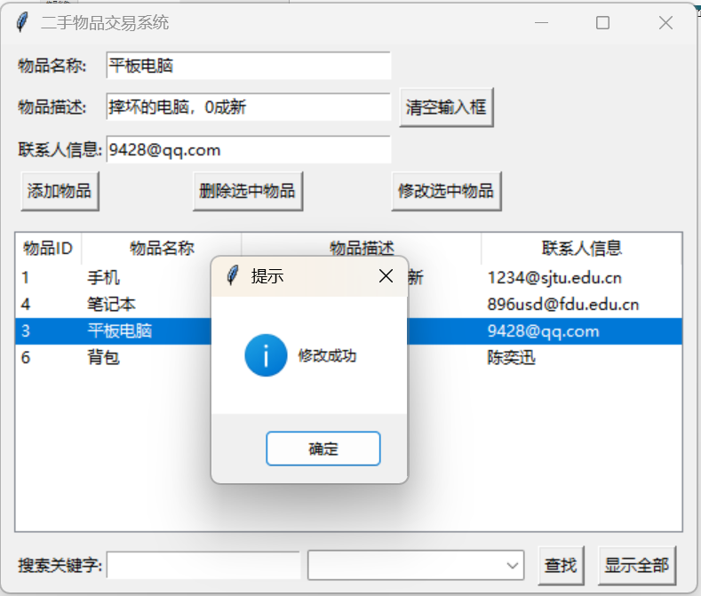</td>
        <td>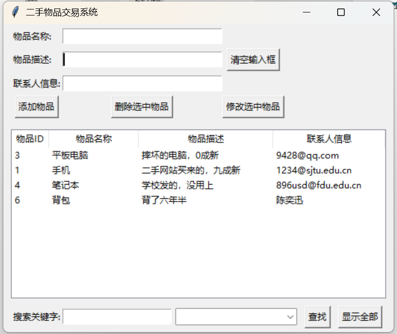</td>
    </tr>
</table>

可以发现，更新完信息后当前物品所在行也更新。这是机制，考虑到**新创建**的物品和**修改信息**的物品有更高的活跃度，因此将这些物品放置在列表头部更加醒目的位置

具体的实现机制如下：成功进行信息更新后，程序会在内部创建一个与原物品有相同的`item.item_id`、更新后描述的新物品，并将原物品的`item.valid`设为`0`，表示失效/过时，新物品的`item.valid`设为`1`；整个过程相当于一次物品的删除和创建，可以模块化编程，同时也具有模块的特性，因此而附在表头

为了防止利用这个有心之人利用这个特性刷屏，若物品的属性都没有改变，程序将不允许进行更改

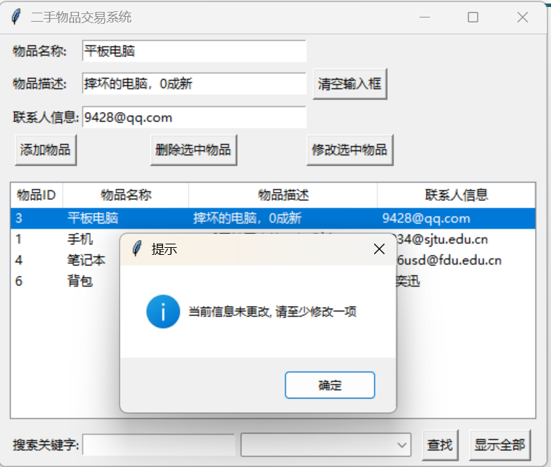

这个功能还能防止相同信息物品的连续创建，若选中后直接点击`添加物品`，则会弹窗警告

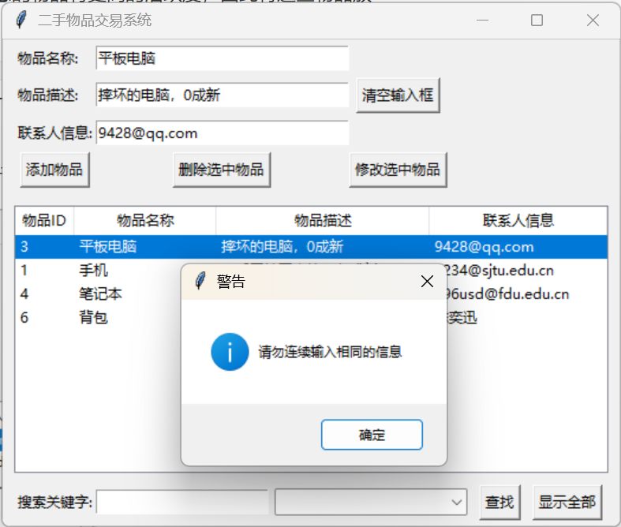

---

### 2.5 查找物品

在底部的输入框中输入关键字，并选择查找项，单机`查找`，列表显示过滤后的物品信息；**支持模糊搜索**

如下图所示，将`@`作为关键字对联系方式进行搜索，中部显示符合条件的物品

此时单机`显示全部`，中部显示当前系统内所有有效的物品

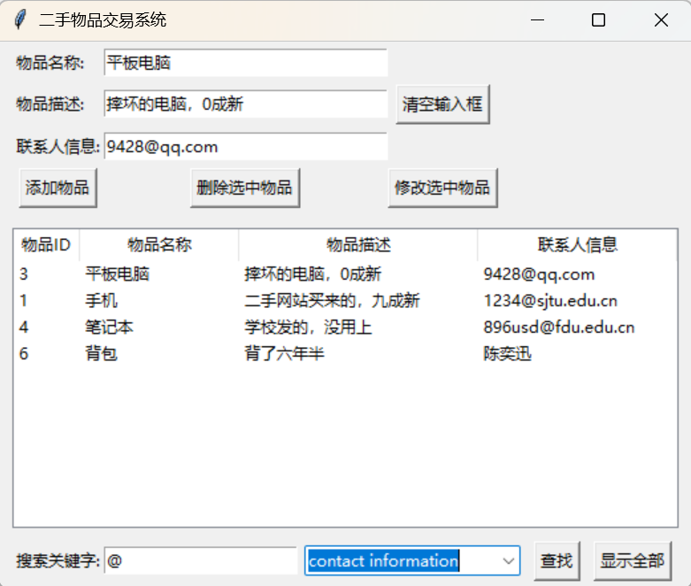

经过搜索过滤的列表仍然能够执行创建、删除和修改物品的功能，但进行上述操作后列表会显示系统内所有有效的物品。这是机制，为了防止创建、修改后的物品被搜索过滤，需要在用户操作后显示全部有效的物品

---

### 2.6 其他

#### 2.6.1 日志

除了前端的界面和后端的数据库外，还保存了GUI的操作日志用于管理员查看信息

>INFO: new item: 手机, created!
>INFO: new item: 笔记本, created!
>INFO: new item: 背包, created!
>INFO: new item: 平板电脑, created!
>INFO: trying to revise item with id: 1 ...
>INFO: new item: 手机, created!
>INFO: trying to revise item with id: 4 ...
>INFO: new item: 笔记本, created!
>INFO: trying to revise item with id: 1 ...
>INFO: new item: 手机, created!
>INFO: trying to revise item with id: 3 ...
>INFO: new item: 平板电脑, created!
>INFO: trying to create item with id: 7
>INFO: new item: 平板电脑1, created!
>INFO:    created an item with id: 7 
>   item: 平板电脑1, 摔坏的电脑，0成新
>   contact information is 9428@qq.com
>
>INFO: trying to delete item with id: 7 ...
>INFO: item with id: 7 has been deleted!
>
>......

#### 2.6.2 清空输入

单击`清空输入框`按钮，可以清空当前输入框内的输入；仅对上部三个输入框有效，对搜索框无效。这是机制，是为选中后输入框出现选中物品信息而配套的

#### 2.6.3 数据库更新

当程序还在运行时，数据库仅会增加物品信息，不会删除

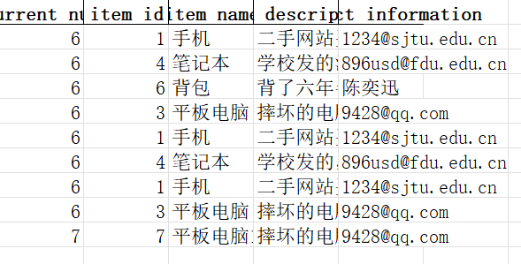

需要注意，上图中最后两行是不同的物品：平板电脑和平板电脑1，因为截图截的不好而像一个东西

当GUI窗口关闭后，程序与数据库进行一次同步，更新数据库，删除`item.valid=0`的物品

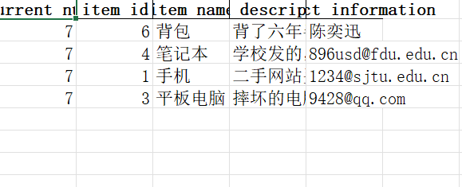

第一列的值表示最新的物品ID