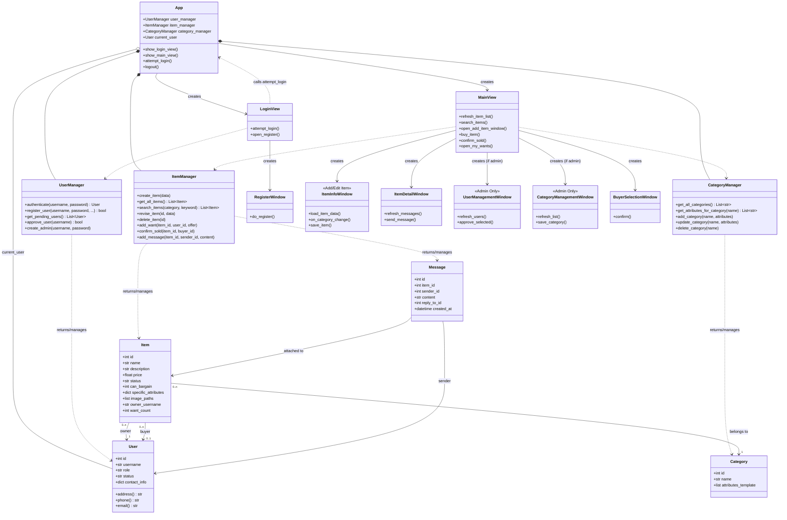

# 二手物品交易系统设计文档

## 一、用例模型

本系统有两个主要参与者：

* **普通用户**: 系统的基本使用者，可以注册、登录、发布和管理自己的物品。
* **管理员**: 拥有管理权限，负责系统的维护工作，如审批新用户和管理物品类别。

系统用例图如下

    

---

## 二、顺序图

### 2.1 新用户注册账户

---

### 2.2 用户登录系统

---

### 2.3 管理员管理用户

---

### 2.4 管理员管理类别

---

### 2.5 普通用户添加物品

---

### 2.6 修改物品

---

### 2.7 删除物品

---

### 2.8 搜索物品

---

### 2.9 购买/发送意向

---

### 2.10 确认出售

---

### 2.11 查看意向

---

## 三、类图

